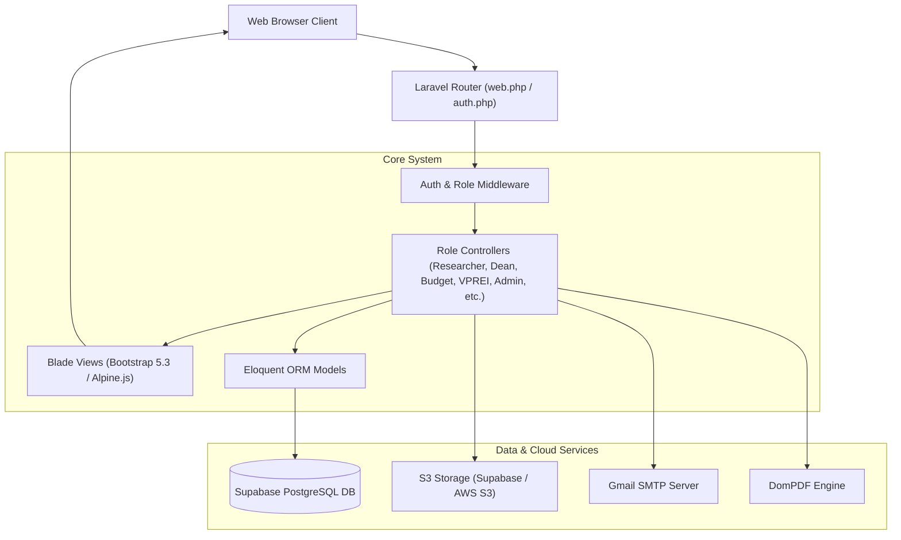
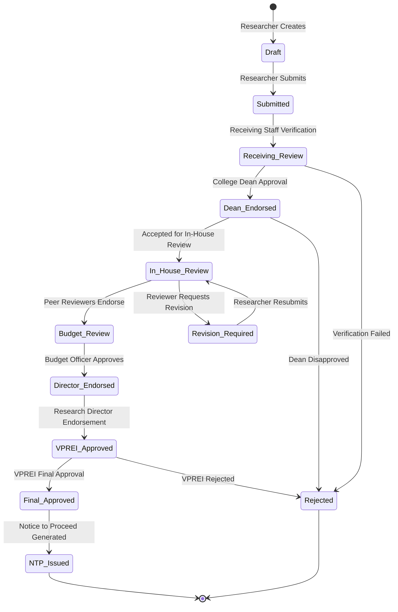

# University Research Lifecycle – Digital Platform (URLC System) — System Report

## 1. System Overview

The **University Research Lifecycle – Digital Platform** (**URLC System**) is an enterprise-grade, role-based research proposal management and institutional workflow platform. Built on top of **Laravel 8**, it digitizes and automates the complete lifecycle of academic research proposals—from initial submission and multi-stage peer review to budget endorsement, director sign-off, and administrative notice-to-proceed (NTP) issuance.

### Core Objectives
* **Streamlined Lifecycle:** Automate multi-tier proposal progression across university roles.
* **Role-Based Governance:** Enforce strict access control, task delegation, and visibility rules across 9 specialized user roles.
* **Integrated Audit & Communication:** Embedded internal messaging, activity logging, and PDF document generation.
* **Cloud Resilience:** Cloud-hosted database and S3-compatible document storage.

---

## 2. Technology Stack

| Layer | Technology / Package | Specification | Purpose |
|---|---|---|---|
| **Backend Framework** | Laravel Framework | v8.75 | Core MVC Architecture & Middleware |
| **Runtime / Language** | PHP | ^7.3 / ^8.0 | Application Logic Execution |
| **Database** | PostgreSQL (Supabase) | Postgres 15+ | Relational Data Store & RLS |
| **Object Storage** | S3 API (Supabase Storage) | Flysystem S3 Driver v3 | Secure Document & Attachment Storage |
| **Authentication** | Laravel Breeze & Sanctum | ^1.10 / ^2.11 | Session Authentication & API Tokens |
| **Frontend Framework** | Blade Templating | Custom Views | Dynamic Server-Side Rendering |
| **UI Framework** | Bootstrap 5.3 + Tailwind CSS | v5.3.3 / v3.1.0 | Responsive Design & Component Styling |
| **Client Scripting** | Alpine.js & Axios | v3.4.2 / v0.21 | Dynamic Interactivity & Async Requests |
| **PDF Engine** | Laravel DomPDF | ^2.2 | Formal Document & NTP PDF Rendering |
| **Activity Logging** | Spatie ActivityLog | v4.0 | User Action Tracking & Audit Trails |
| **Build System** | Laravel Mix (Webpack 5) | v6.0.49 | Asset Compilation & Bundling |

---

## 3. System Architecture & Workflows

### 3.1 Architecture Overview



---

### 3.2 Proposal Lifecycle State Diagram



---

## 4. Role-Based Access Control (RBAC)

The system supports **9 specialized system roles**, each with tailor-made dashboards, permission scopes, and actionable queues:

| Role Name | Scope & Responsibilities | Key Dashboard Features |
|---|---|---|
| **Researcher** | Create, edit, and resubmit research proposals; monitor budget & reviews | Active proposals table, revision requests, message inbox |
| **Receiving Staff** | Verify incoming proposals for compliance and preliminary requirements | Intake queue, document check, endorsement trigger |
| **College Dean** | Review proposals originating from their specific academic college | Departmental KPI cards, college proposal queue, approval modal |
| **Reviewer** | Evaluates assigned proposals, adds scores, comments, and suggestions | Assigned evaluations table, score cards, evaluation forms |
| **Budget Officer** | Evaluates financial line items, verifies funding availability | Budget items line table, funding status, financial gatekeeper |
| **Research Director** | Evaluates institutional alignment, endorses cleared proposals | Endorsement workflow, strategic proposal queue |
| **VPREI** | Executive approval (Vice President for Research, Extension & Innovation) | Executive KPIs, final decision interface, clearance toggle |
| **Admin / Super Admin** | User management, system metrics, role assignment, NTP PDF generation | Comprehensive KPI metrics, user management, NTP generation, system logs |

---

## 5. Database Schema & Data Models

### 5.1 Primary Tables

#### `users` Table
* `id` (PK), `name`, `email`, `password`, `role` (enum/string: researcher, reviewer, dean, budget_officer, director, vprei, admin, super_admin, receiving_staff), `college_id`, `is_approved`, `timestamps`.

#### `research_proposals` Table
* `id` (PK), `proposal_code`, `user_id` (FK → users), `title`, `abstract`, `research_field`, `budget_requested`, `budget_approved`, `status`, `review_comments`, `review_suggestions`, `document_path`, `ntp_path`, `timestamps`.

#### `proposal_budget_items` Table
* `id` (PK), `proposal_id` (FK → research_proposals), `item_name`, `category` (PS, MOOE, CO), `amount`, `justification`, `timestamps`.

#### `messages` & `conversations` Tables (Gmail-Style Messaging)
* `id` (PK), `conversation_id`, `sender_id` (FK → users), `receiver_id` (FK → users), `subject`, `body`, `is_read`, `deleted_by_sender`, `deleted_by_receiver`, `timestamps`.

---

## 6. Key System Modules

### 6.1 Direct Messaging Module (Gmail-Style)
* **Threaded Conversations:** Fully integrated internal messaging system supporting subject-based conversation grouping.
* **Inbox / Sent / Trash:** Folder categorization with real-time unread counts and read status tracking.
* **Global Accessibility:** Embedded in sidebar navigation across all dashboards.

### 6.2 Document & PDF Generation Module (Notice to Proceed - NTP)
* **DomPDF Engine:** Renders official administrative Notice to Proceed (NTP) documents.
* **Inline Vector Rendering:** Standardized with inline SVG vectors to guarantee flawless PDF compilation across servers lacking native GD image extensions.
* **S3 Synchronization:** Automatically stores generated PDF documents directly to S3-compatible cloud buckets.

### 6.3 Security & Row-Level Protection
* **Supabase Row Level Security (RLS):** Policies applied on PostgreSQL tables (e.g. `proposal_budget_items`) restricting CRUD operations based on authenticated user IDs.
* **Laravel Role Middleware:** Prevents unauthorized route access based on session role.
* **CSRF & File Upload Guards:** Strict PDF validation (max 20MB) and anti-CSRF token verification across all request handlers.

---

## 7. How to Run Locally

```bash
# 1. Clone & Install Dependencies
composer install
npm install

# 2. Setup Environment Configuration
cp .env.example .env
php artisan key:generate

# 3. Configure Database (.env)
# DB_CONNECTION=pgsql
# DB_HOST=aws-1-ap-south-1.pooler.supabase.com
# DB_PORT=6543
# DB_DATABASE=postgres

# 4. Execute Migrations & Asset Compilation
php artisan migrate
npm run dev

# 5. Link Cloud/Local Storage & Start Development Server
php artisan storage:link
php artisan serve
```
