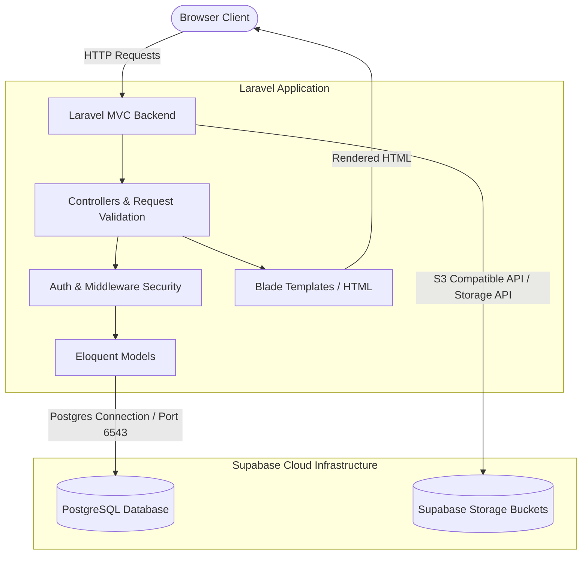

# System Architecture

The **URLC System** is designed as a secure, scalable web application following the classic Model-View-Controller (MVC) pattern. All business logic is evaluated server-side to guarantee security, integrity, and performance.

## Architectural Highlights

### 1. Server-Side Execution (MVC)
*   **Routing & Controllers:** Routing is managed by `routes/web.php`. Request handling, validation, and authorization are handled in Controllers under `app/Http/Controllers`.
*   **Views:** Templating uses Laravel's built-in **Blade Engine** combined with **Tailwind CSS** for layout styling and **Alpine.js** for minor client-side interactivity.

### 2. Database Integration
*   **PostgreSQL Engine:** The database is hosted on **Supabase**. We connect using a direct connection pooler (TCP port 6543) via PDO.
*   **Eloquent ORM:** Database queries are modeled dynamically using Laravel's Eloquent ORM, allowing secure query building, relationships, and migrations.

### 3. File Storage
*   **Private S3 Integration:** Research proposals and documents contain sensitive intellectual property. Instead of local storage, the system is integrated with private **Supabase Storage Buckets** using the S3 compatibility layer. All document access is secured via backend-generated temporary pre-signed URLs.

### 4. Role-Based Access Control (RBAC)
*   **Role Identification:** The application has distinct roles: `researcher`, `reviewer`, `admin` (superadmin), `coordinator`, and `staff`.
*   **Authorization:** Middleware and Laravel Policies verify that only authorized roles can perform specific actions (e.g. assigning reviewers, updating proposal status).
