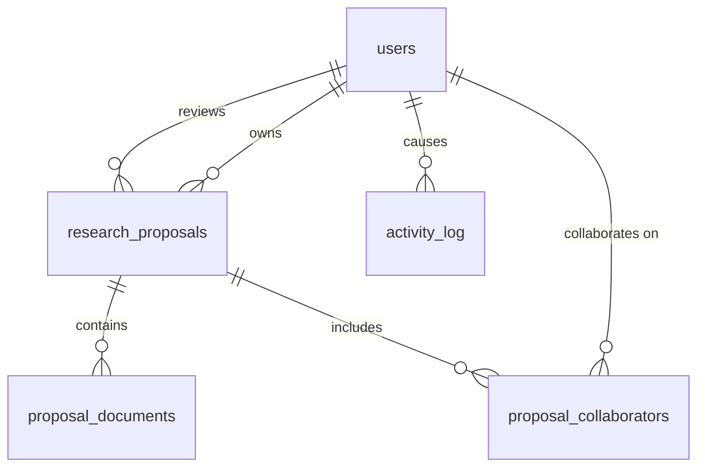

# Database Schema

The database for the URLC System is built using **PostgreSQL** hosted on **Supabase**. The schema is managed dynamically via Laravel Migrations.

## Core Entities

### 1. `users`
Stores user authentication information, roles, and registration metadata.
*   `id` (bigint, PK)
*   `name` (varchar)
*   `email` (varchar, Unique)
*   `role` (varchar) — `researcher`, `reviewer`, `coordinator`, `staff`, `admin`, `recording_staff`
*   `department` (varchar, Nullable)
*   `is_approved` (boolean) — Admin accounts require manual activation.
*   `timestamps`

### 2. `research_proposals`
Stores details of research proposals submitted by researchers.
*   `id` (bigint, PK)
*   `proposal_code` (varchar, Unique)
*   `user_id` (bigint, FK) — Owner/lead researcher of the proposal.
*   `title` (varchar)
*   `abstract` (text)
*   `status` (varchar) — `draft`, `submitted`, `under_review`, `approved`, `rejected`
*   `phase` (integer) — Tracked development stage.
*   `reviewer_id` (bigint, FK, Nullable) — Assigned reviewer.
*   `timestamps`

### 3. `proposal_collaborators`
Maintains relations for secondary researchers working on a proposal.
*   `id` (bigint, PK)
*   `proposal_id` (bigint, FK)
*   `user_id` (bigint, FK)
*   `timestamps`

### 4. `proposal_documents`
Tracks file uploads associated with a proposal (stored privately in Supabase Storage).
*   `id` (bigint, PK)
*   `proposal_id` (bigint, FK)
*   `file_path` (varchar) — File path inside the S3 storage bucket.
*   `file_name` (varchar)
*   `file_type` (varchar)
*   `timestamps`

### 5. `activity_log`
Audit trails for all critical database modifications and user sessions.
*   `id` (bigint, PK)
*   `log_name` (varchar, Nullable)
*   `description` (text)
*   `subject_type` / `subject_id` (polymorphic morphs)
*   `causer_type` / `causer_id` (polymorphic morphs)
*   `properties` (json, Nullable)
*   `event` (varchar)
*   `batch_uuid` (uuid, Nullable)
*   `timestamps`

---

## Schema Diagram (Relationships)

