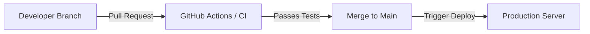

# CI/CD & DevOps Guidelines

Maintaining code quality and ensuring all tests pass before code is merged is critical for system stability.

## Continuous Integration (CI)

Our CI pipeline enforces quality checks automatically on pull requests to the `main` or `develop` branches.

### Pre-commit Checklist

Before pushing code changes to GitHub, developers should run the following commands locally:

#### 1. Run the Automated Tests
Ensure your changes did not break existing functionality:
```bash
php artisan test
```

#### 2. Run Code Style Checks
We use code styling tools to keep the codebase clean. If you need to check files against style rules:
```bash
# Example if using Laravel Pint (or similar formatting tools)
vendor/bin/pint --test
```

---

## Deployment Workflow



### Production Checklist
When prepping for a release:
1. Ensure new environment variables are added to production `.env` (e.g. S3 Storage Keys or Database credentials).
2. Run database migrations:
   ```bash
   php artisan migrate --force
   ```
3. Optimize configuration and route caching:
   ```bash
   php artisan config:cache
   # and
   php artisan route:cache
   ```
